<h2 align="center"><i>Yuno-obsessed</i></h1>

<i>Networking and low level programming enjoyer™</i>

<h3 align="center"><i>*Always challenge yourself*</i></h2>
<h3 align="center"><i>*Stay wild*</i></h2>

<a href="https://discord.com/users/566566562031468554"><code></code></a>

<h1 align="center"> <a href="https://octo-ring.com/register">+</a> <a href="https://octo-ring.com/p/Yuno-obsessed/prev"><</a>  
<a href="https://octo-ring.com/p/Yuno-obsessed/next">></a> <a href="https://octo-ring.com/p/Yuno-obsessed/random">!</a>
</h1>

GitHub Metrics

